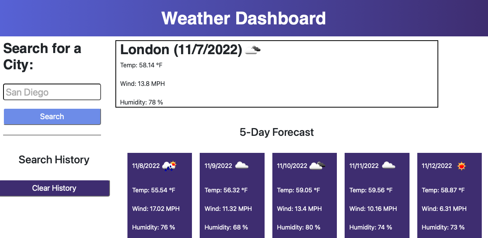

# weather-dashboard

## Description
The purpose of this project was to create an application to make requests using third-pary APIs with specific parameters in order to access their data. The process of creating this involved using the openweathermap.org API to pull weather data from a city search and display it on the dashboard. However, to complete this task the city's coordinated were necessary which were pull from another end point of the API. Next, the fetch requests needed to be make in the correct order so the functions would complete without error. Finally localStorage was implemented to retain a search history to view prior searches.

## Installation

N/A

## Deployed Webpage

Deployed URL: https://koreycollazo.github.io/weather-dashboard/

## Credits

N/A

## License

N/A
